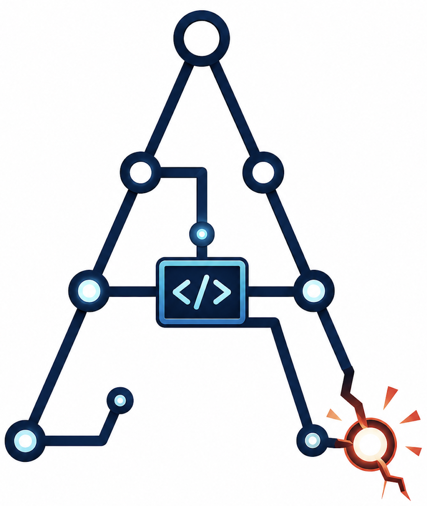
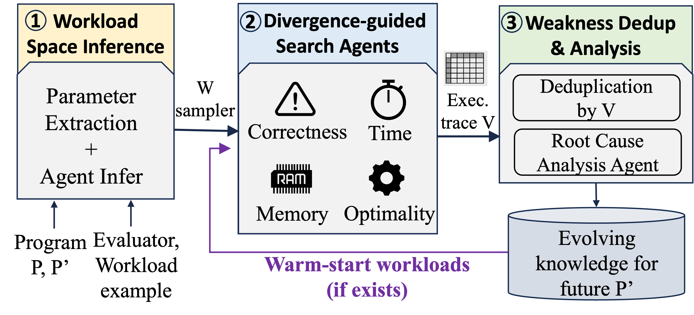

<h1 align="center">
  <br>
  AIChilles Risk Discovery
</h1>

<p align="center">Automatically Uncovering Hidden Weaknesses in AI-Evolved Systems.</p>

<p align="center">
  <a href="https://arxiv.org/abs/2606.15834"></a>
  <a href="#-the-four-weakness-types"></a>
  <a href="#-running-on-each-app"></a>
</p>

<p align="center">
  
</p>

---

**AIChilles Risk Discovery** is a 3-agent pipeline that stress-tests a *candidate* program `P'`
(produced by an automated discovery / evolution system) against its *reference* program `P`,
and surfaces the workloads where `P'` quietly goes wrong — crashes, worse targeted performance, blow-ups in
time, or blow-ups in memory.

---

## ✨ Highlights

- **🔎 Coverage-guided, LLM-mutated search.** Agent 2 runs a MAP-Elites loop using `sys.settrace`
  coverage as the novelty signal and an LLM as the workload mutator — it chases *unseen* code
  paths, not random noise.
- **🐞 Four weakness types in one pass.** Every oracle call checks correctness, time-scalability,
  memory-scalability, and optimality simultaneously (see [below](#-the-four-weakness-types)).
- **🧬 Auto-inferred input grammar.** Agent 1 reads the app's `evaluator.py` (AST extraction + LLM
  enrichment) and writes a `generate_workload()` sampler — no hand-written fuzz harness needed.
- **🧠 Cross-run knowledge base.** Confirmed weakness "seeds" persist per app and **warm-start**
  later runs, so discovery compounds over time.

---

## 🐞 Four weakness types

Each oracle call compares `P'` against the reference `P` on the same workload and flags any of:

| Type | What it means | Trigger |
|:---|:---|:---|
| 🟥 **correctness** | `P'` crashes, times out, or returns a wrong/invalid result | hard failure vs `P` |
| ⏱️ **scalab_time** | `P'` is dramatically slower as the workload scales | runtime blow-up vs `P` |
| 💾 **scalab_mem** | `P'` uses dramatically more memory as the workload scales | memory blow-up vs `P` |
| 📉 **optimality** | `P'` runs fine but produces a measurably worse solution | quality gap vs `P` |

---

## 🚀 Quick Start

**Prerequisites:** Python ≥ 3.10 and an Anthropic API key.

```bash
# Install all dependencies (pipeline + the 5 ADRS apps)
pip install -e .          # or:  uv sync
export ANTHROPIC_API_KEY=sk-...
```

> **Run everything from the repository root.** All commands below assume your working
> directory is the repo root (where this README lives).

**Smoke test (~5 min, tiny budget):**

```bash
python aichilles_risk_discovery/run_all_app.py \
  --app eplb \
  --best_program benchmarks/ADRS/eplb/best/claude/adaevolve/best_program.py \
  --budget 10 --patience 2
```

Results land in `aichilles_risk_discovery/results/eplb/eplb_<timestamp>/` — open `report.md`.

---

## ▶️ Running on each app

The pipeline ships with **5 system applictaions** (from the SkyDiscover
[ADRS benchmark](https://github.com/skydiscover-ai/skydiscover/tree/main/benchmarks/ADRS)).
The `--best_program` path follows the pattern
`benchmarks/ADRS/<app>/best/<model>/<method>/best_program.py`, where `<model>` ∈ `{claude, gpt}`
and `<method>` ∈ `{adaevolve, engram, openevolve}`.

**Template:**

```bash
python aichilles_risk_discovery/run_all_app.py \
  --app <app> \
  --best_program benchmarks/ADRS/<app>/best/claude/adaevolve/best_program.py \
  --budget 200 --patience 5
```

| App | `--app` | Domain | Extra data setup |
|:---|:---|:---|:---|
| ⚖️ **EPLB** | `eplb` | MoE expert load balancing | ⚠️ download `expert-load.json` (see below) |
| ☁️ **Cloudcast** | `cloudcast` | Cross-cloud broadcast scheduling | run `download_dataset.sh` (see below) |
| 🗄️ **LLM-SQL** | `llm_sql` | SQL query planning | run `download_dataset.sh` (see below) |
| 🧮 **PRISM** | `prism` | GPU model placement | none |
| 🔀 **Txn Scheduling** | `txn_scheduling` | Transaction scheduling | none |

### 📥 Data setup (only some apps)

Some apps depend on data files that are **not committed** (they're large / gitignored). Set them
up once before running those apps:

```bash
# eplb — workload file from Hugging Face
cd benchmarks/ADRS/eplb
wget https://huggingface.co/datasets/abmfy/eplb-openevolve/resolve/main/expert-load.json
cd -

# cloudcast — cost/throughput profiles + example configs
# (run from inside the app dir — the script uses relative paths)
cd benchmarks/ADRS/cloudcast && bash download_dataset.sh && cd -

# llm_sql — query datasets
cd benchmarks/ADRS/llm_sql && bash download_dataset.sh && cd -
```

`prism` and `txn_scheduling` generate their workloads internally — no download needed.

---

## ⚙️ All flags (`run_all_app.py`)

| Flag | Default | Description |
|:---|:---|:---|
| `--app` | **required** | One of `cloudcast`, `eplb`, `llm_sql`, `prism`, `txn_scheduling` |
| `--best_program` | **required** | Path to the candidate `best_program.py` (`P'`) |
| `--budget` | `200` | Max oracle calls for Agent 2 (split evenly across the 4 weakness types) |
| `--patience` | `5` | Stop a type-agent after this many rounds with no new weaknesses |
| `--theta` | `0.1` | Novelty threshold (L1 distance) **and** clustering threshold |
| `--agent2_types` | all 4 | Subset of weakness types to run, e.g. `--agent2_types scalab_time optimality` |
| `--skip_agent1` | off | Reuse an existing `grammar.json` in `--results_dir` |
| `--skip_agent2` | off | Skip all exploration (shorthand for empty `--agent2_types`) |
| `--results_dir` | auto | Reuse an existing results directory (required when skipping agents) |

---

## 📦 Output layout

Each run writes a timestamped directory under `aichilles_risk_discovery/results/<app>/`:

```
results/eplb/eplb_20260518_132822/
├── config.json          # args used for this run (reproducibility)
├── grammar.json         # Agent 1: config + workload parameter schemas
├── generate_workload.py # Agent 1: callable (c, w) sampler
├── matrix_V.json        # Agent 2: every (c, w) tried, with coverage + oracle labels
├── clusters.json        # Agent 3: weakness clusters with root-cause hypotheses
└── report.md            # Agent 3: human-readable report, one section per cluster
```

The per-app **knowledge base** (persists across runs and warm-starts the next one) lives at
`results/<app>/knowledge_base.json`.

---

## 🔁 Resuming & partial re-runs

```bash
# Resume an interrupted Agent 2 (reuse the same grammar.json)
python aichilles_risk_discovery/run_all_app.py \
  --app eplb \
  --best_program benchmarks/ADRS/eplb/best/claude/adaevolve/best_program.py \
  --skip_agent1 \
  --results_dir aichilles_risk_discovery/results/eplb/eplb_20260518_132822
```

---

## 📊 Post-analysis: plot `P` vs `P'`

After a run, `plot_bugs.py` re-runs `P` and `P'` on the discovered witnesses and draws a grid —
**rows = weakness clusters, columns = workload parameters** — with raw `P` (blue) vs `P'` (red)
values, so you can spot the most informative axis.

```bash
# Fast: plot from stored data only, no re-runs
python aichilles_risk_discovery/plot_bugs.py \
  aichilles_risk_discovery/results/eplb/eplb_20260518_132822 \
  --no_reproduce --max_witnesses 0 \
  --out eplb_weaknesses.png

# Full: re-execute P and P' on up to 30 witnesses per cluster
python aichilles_risk_discovery/plot_bugs.py \
  aichilles_risk_discovery/results/eplb/eplb_20260518_132822 \
  --max_witnesses 30 --out eplb_weaknesses.png
```

---

## 🔗 AI-evolved System Framework References

The candidate programs (`P'`) were produced by three evolutionary methods (the `<method>` in the
`--best_program` path):

- **AdaEvolve** / **OpenEvolve** — from [SkyDiscover](https://github.com/skydiscover-ai/skydiscover)
- **Engram** — from [mit-nms/Engram](https://github.com/mit-nms/Engram/tree/engram)

This repo ships the `best_program.py` we found for every combination of all 3 frameworks above,
each evolved with **2 LLMs** (`gpt` = GPT-5, `claude` = Claude-Opus-4.6), across all 5 apps. Feel
free to drop in your own `best_program.py` and point `--best_program` at it.
